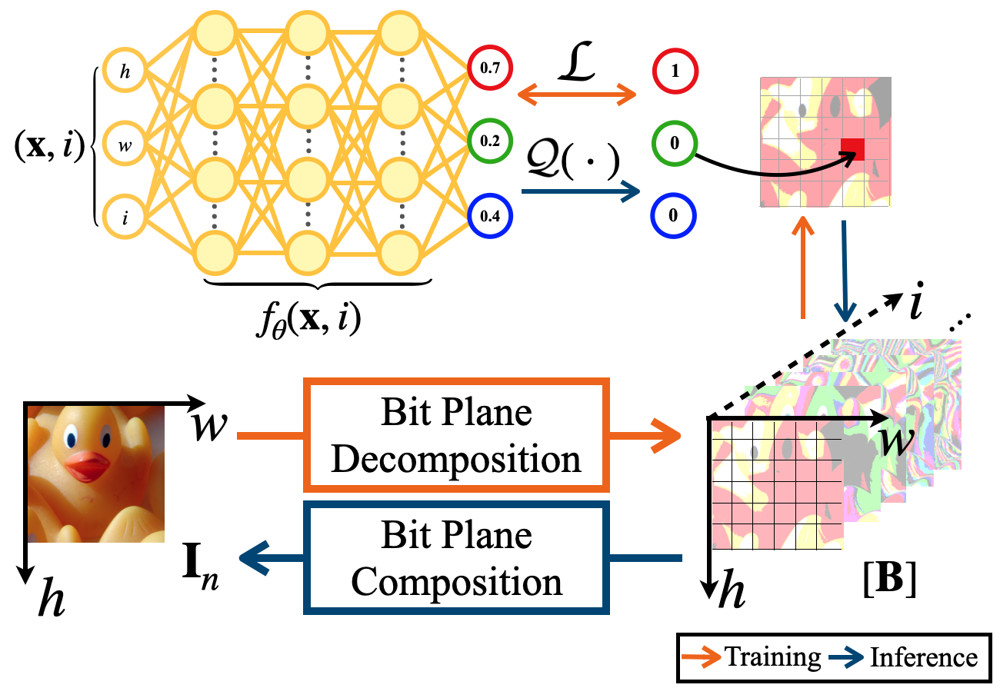

  # Towards Lossless Implicit Neural Representation via Bit Plane Decomposition

This repository contains the official implementation of the following paper:

Towards Lossless Implicit Neural Representation via Bit Plane Decomposition (CVPR 2025) (Accepted)

[](https://arxiv.org/abs/2502.21001)


## Overall Structure



## Installation
Our code is based on Ubuntu 20.04, pytorch, CUDA (NVIDIA RTX 3090 24GB, sm86) and python.

For enviorment setup, we recommend to use CONDA for the installation:

```
conda env create --file env.yaml
conda activate linr
```

We include 8-bit and 16-bit image fitting training code and 1.58-bit weight INR of our main paper.

## Experiment


The basic train code are following:

**Lossless Image Fitting** :


```
python train.py --img_path YOUR_IMAGE_PATH/FANCY_IMAGE.png --num_bits bit_depth --save --img_size 256
```

**Image Fitting with 1.58-bit INR** : 

```
python train_ternary.py --img_path YOUR_IMAGE_PATH/FANCY_IMAGE.png --num_bits bit_depth --save --img_size 128
```


### Command-line Arguments

- `--img_path`: **(Required)** Path to the input image.
- `--num_bits`: Bit depth for decomposition (choose **8** or **16**).
- `--save`: Flag to save output images during training.
- `--img_size`: Size (width/height) to which the input image will be resized (default is 256).

Additional optional arguments:

- `--gpu`: GPU id(s) to use (e.g., `"0"` or `"0,1"`).
- `--tag`: Experiment tag for organizing logs and saved models.
- `--flag`: Additional custom flag for directory naming.
- `--total_steps`: Total number of training iterations (default: 10000).
- `--lr`: Learning rate for the optimizer (default: 1e-4).


They will prodice save file, Tensorflow Summary, text record of iteration. 

 Note that PIL do not support 16-bit image, so opencv (cv2) is used for saving and loading 16-bit image. 

## Acknowledgements

Our backbone models of the code are built on [SIREN](https://github.com/vsitzmann/siren) and [NeRF](https://github.com/bmild/nerf). We thank the authors for sharing their codes.